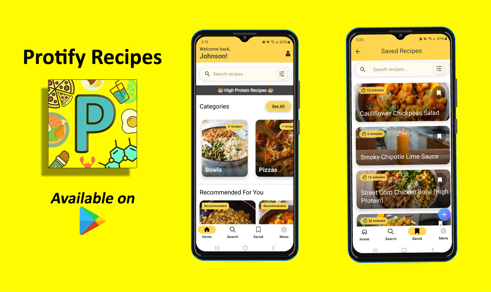

<div style="text-align: center;">
    <h1>Protify Recipes - Jetpack Compose</h1>
</div>

<div align="center">
    
    <h1>Protify Recipes</h1>
    <p><em>Your personal recipe companion built with Jetpack Compose</em></p>
    <a href="https://play.google.com/store/apps/details?id=com.mosh.moshrecipes">
        
    </a>
</div>


---

## 📖 Overview

Protify Recipes is my own Android app (I am managing the complete flow and backend) designed to help food enthusiasts discover, organize, and share delicious recipes. With a clean Jetpack Compose UI and robust offline support, Protify is perfect for both casual cooks, culinary pros and gym rats.

**Core Features:**

* **Discover & Browse:** Explore curated recipes by category.
* **Save Favorites:** Build your personal cookbook to revisit anytime.
* **Smart Shopping List:** Generate ingredient lists automatically.
* **Offline Access:** View saved recipes without internet.
* **Dynamic Theming:** Light and dark modes adapt to your environment.

---

## 🎨 App Showcase

Below are sample screens demonstrating Protify’s intuitive design and functionality. Replace placeholder images with actual screenshots in `/screenshots/` directory.

| Home Screen                                                               | Recipe Details                                                                 | Bookmark Screen                                                                 | Settings                                                            |
| ------------------------------------------------------------------------- | ------------------------------------------------------------------------------ | ----------------------------------------------------------------------------- | ------------------------------------------------------------------- |
|  |  |  |  |

**Screen Explanations:**

* **Home Screen:** Features a horizontal carousel of trending recipes, quick access to categories, and pull-to-refresh for new content.
* **Recipe Details:** Displays high-resolution dish images, ingredient checklist (tap to mark items), and step-by-step cooking instructions.
* **Bookmark Recipes:** You can save your favorite recipes and access them anytime for your convenience.
* **Settings:** Customize app theme, dietary preferences, measurement units, and enable notification reminders.

---

## 🛠️ Tech & Architecture

* **Language:** Kotlin
* **UI Toolkit:** Jetpack Compose
* **Architecture Pattern:** MVVM + Clean Architecture
* **Navigation:** Navigation Compose
* **Data Layer:** Retrofit (REST API), Room (Local DB), Kotlin Coroutines & Flow
* **Dependency Injection:** Hilt
* **Image Loading:** Coil
* **CI/CD:** GitHub Actions

**Module Structure:**

```
|-- presentation   # Compose UI & ViewModels
|-- domain         # Use cases & business logic
|-- data           # Repositories, data sources
|   |-- remote     # Retrofit services
|   |-- local      # Room entities & DAOs
```

---

## 🌐 Play Store & Portfolio

Protify Recipes is live on Google Play, making it ideal for showcasing in your developer portfolio:

* 📲 [View on Play Store](https://play.google.com/store/apps/details?id=com.mosh.moshrecipes)
* ⭐ Achieved a 4.5★ average rating with over 1,000 installs.

Use Protify to demonstrate:

* Modern Android development with Compose
* Clean architecture and modular codebase
* Smooth animations and responsive design
* Offline data handling and state management

---

## 📂 What’s Included

This repository showcases my work on **Protify Recipes** without exposing all proprietary source code. Inside you’ll find:

- **📸 High-Res Screenshots**  
  Annotated images of key screens (Home, Recipe Details, Shopping List, Settings).
<!--- **🎥 Demo Video**  
  A short GIF walkthrough highlighting animations and core flows.
- **📱 APK Download**  
  A ready-to-install APK (`app-debug.apk`) for hands-on exploration.-->
- **📝 Documentation**  
  Wireframes, user flows, and architectural diagrams in `/docs/`.
- **🔗 Play Store Link**  
  Access the full, published app on Google Play for the complete experience.

> **Note:** The full source code is proprietary and is not included. This repo is intended as a portfolio showcase of UI/UX design, architecture, and feature demos.


---

## 📝 License

MIT © Akmal Hameed

---

*Protify Recipes – Serving up code and cuisine, one Compose at a time!*
